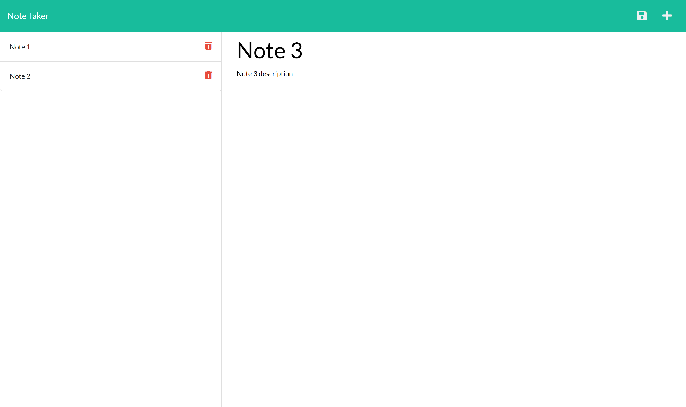

  # Project Title: Readme Generator

  ### Table of Contents
  * [Description](#description)
  * [Installation](#installation)
  * [Usage](#usesage)
  * [Credits](#credits)
  * [License](#license)

  ## Description
  It will generate a readme based on what you input in the console.

  ## Click for Demo
  

  ## Installation
  Install Node, NPM, run index.js

  ## Useage
  It is made to save you time in generating a readme for your github.

  ## Credits
  none

  ## License
  This application is covered under the MIT License

  ## Test
  none

  ## Questions? 
  Contact: 
  johnson90cm
  johnson90.cm@gmail.com
